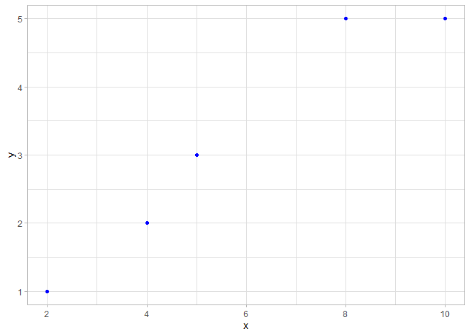
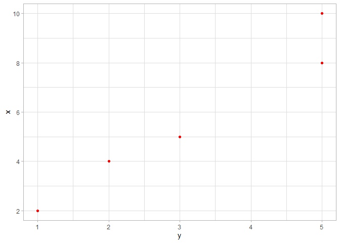

<!-- README.md is generated from README.Rmd. Please edit that file -->

# Scatterplot

<!-- badges: start -->

<!-- badges: end -->

The goal of scatterplot is to create a scatterplot which makes the
relationship between two variables specified in the input of the
function (x and y) visualized.

## Installation

You can install the released version of scatterplot from
[CRAN](https://CRAN.R-project.org) with:

``` r
devtools::install_github("Tian-Liu-Alice/scatterplot")
```

## Example

This is a basic example which shows you how to solve a common problem:

``` r
library(scatterplot)
## basic example code
test <- data.frame(
    x = c(2,4,5,8,10),
    y = c(1,2,3,5,5),
    z = c(1,2,5,7,9))
scatterplot(test, x, y)
```



``` r
scatterplot(test, y, x, "red")
```




